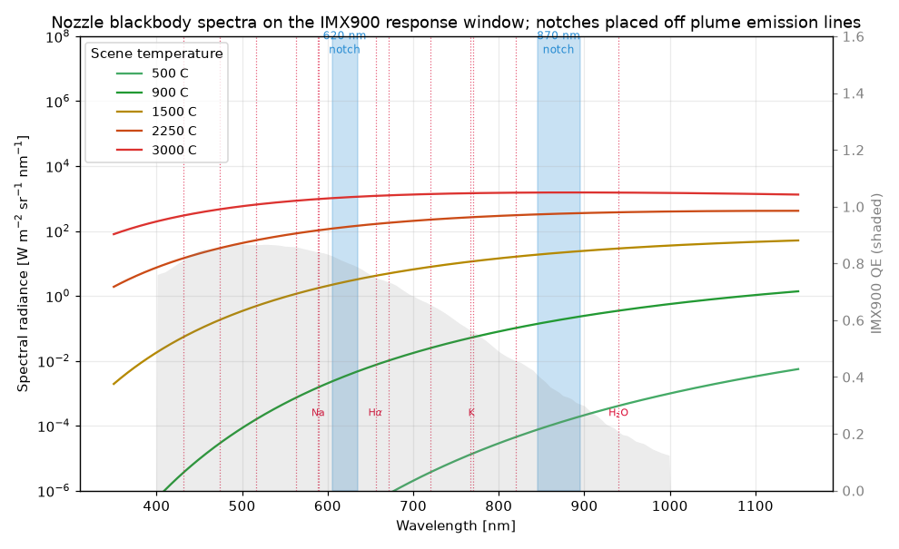
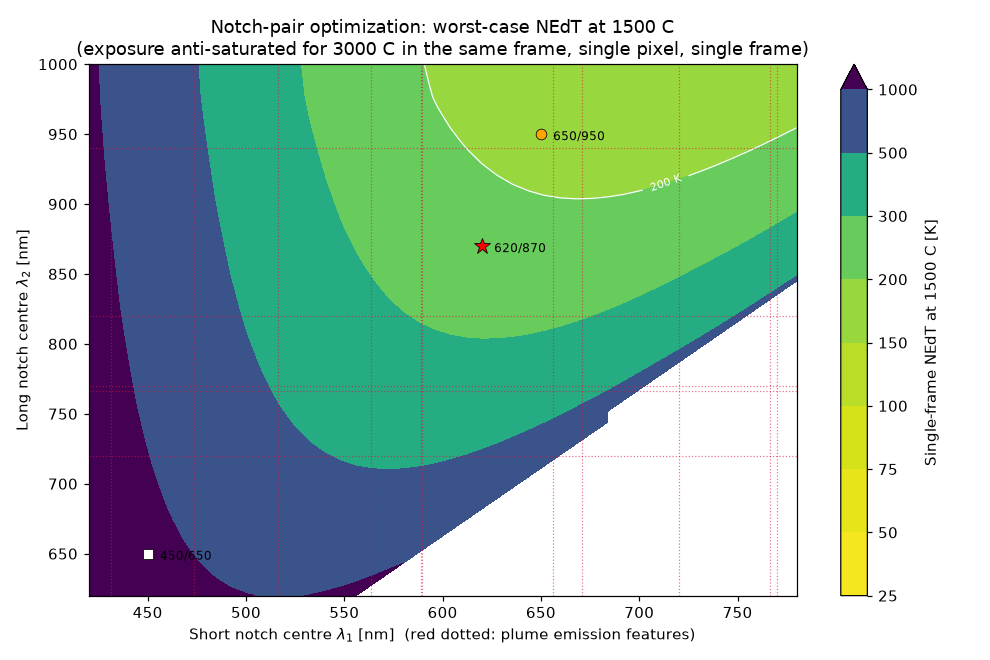
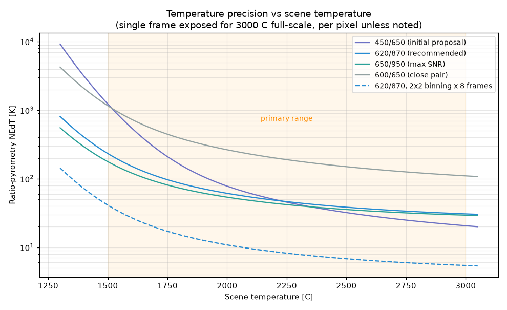
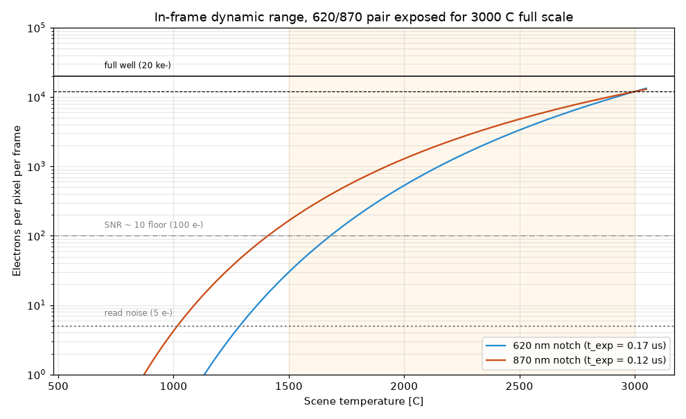

# Nozzle Thermography by Two-Notch Ratio Pyrometry

**Mission:** video mapping of engine-nozzle temperature heterogeneity.
Scene spans 500–3000 °C simultaneously; accuracy matters most at
1500–3000 °C. Conventional IR cameras cannot survive close to the engine.

**Approach under study:** a visible/NIR camera with one or two narrowband
("notch") filters, calibrated against blackbody sources, inverting Planck's
law for temperature. The instrument model throughout is the **Sony
IMX900-AMR-C** in its large-well (LCG) mode behind F/4 optics — the same
model the interactive app (`streamlit_app.py`) uses by default, with the
sensor parameters and QE table sourced as described in `ircam/sensors.py`.

All numbers are computed by `ircam.pyrometry` (validated in
`tests/test_pyrometry.py` and `tests/test_verification.py`) and
regenerated by `analysis/nozzle_pyrometry.py` into
[`computed_nozzle_results.md`](computed_nozzle_results.md). The
formula-by-formula verification record is in
[`verification.md`](verification.md).

---

## 1. A visible/NIR camera is the right instrument for 1500–3000 °C

At 3000 °C the Planck peak sits at **0.89 µm — inside the IMX900's
response**; at 1500 °C the visible tail is still enormous (10⁷× more
650 nm radiance than at 500 °C). Above ~1000 °C, visible/NIR pyrometry is
the *superior* instrument, not a workaround:

* **Signal is never scarce — the problem is too much light.** Exposures
  anti-saturated for 3000 °C come out at **0.3–0.4 µs** on the IMX900 at
  F/4; the design carries ND filters (about OD 1) to stay above the
  global-shutter exposure floor, not bigger apertures.
* **Standoff solves survivability.** A visible telephoto at tens of
  metres behind a sacrificial window does the job with inexpensive glass
  optics and a 3.2 MP array for heterogeneity mapping — which LWIR
  cannot offer (an uncooled LWIR camera would also saturate, and its
  relative contrast at 3273 K is ~10× worse than at 300 K).
* **The plume veils the surface in the IR, not in the visible.** Hot
  H₂O/CO₂ exhaust radiates intensely in MWIR/LWIR bands and would glare
  over the nozzle; a non-sooty plume is nearly transparent at visible/NIR
  wavelengths chosen off its emission lines (§3).

## 2. One notch vs two

**One notch** ("brightness pyrometry") determines T only if the absolute
radiometric chain is known: emissivity, window fouling, lens vignetting,
plume obscuration, and partial pixel fill all multiply the signal and
read directly as temperature error, dT = (λT²/c₂)·(dS/S). At 650 nm and
3000 °C, **every 10% of unknown multiplicative factor is 48 K of error**
— and window fouling during a firing is not a 10% effect.

**Two notches** ("ratio / two-color pyrometry" — a mature, named
technique) take the per-pixel ratio R = S₁/S₂, which cancels *every*
common-mode multiplicative unknown. In the Wien limit (excellent here),

$$\ln R = \text{const} - \frac{c_2}{T}\Big(\frac{1}{\lambda_1}-\frac{1}{\lambda_2}\Big),$$

so 1/T is linear in ln R with a single calibration constant. A two-point
fit of the two notch signals to the blackbody curve is exactly this: two
measurements, two unknowns (T and the combined scale factor) — exactly
determined. A **third notch** is worth carrying as a consistency channel:
three bands over-determine the fit, and disagreement between the three
pairwise temperatures flags non-gray emissivity or line contamination on
a per-pixel basis.

The residual systematic of the ratio is *non-gray* emissivity (ε varying
between the two bands): a 5% ε-slope read as gray biases by **+23 K at
1500 °C / +82 K at 3000 °C** for the recommended pair. Refractory nozzle
surfaces (C–C, graphite, tungsten) are quite gray over 0.6–0.9 µm, and
the bias is calibrable against a sample coupon.

## 3. Where to put the notches: the optimization

Noise and bias both propagate through the **equivalent wavelength**
λ_eq = λ₁λ₂/(λ₂−λ₁):  σ_T = (λ_eq T²/c₂)·(σ_R/R). Spacing matters, and
the law is unforgiving: a close pair (600/650 nm) has λ_eq = 7800 nm —
**3.6× the noise amplification** of 620/870 (λ_eq = 2158 nm). The notches
should be spread.

What limits the spread is the *cold end of the primary range in a single
video frame*. With exposure pinned by 3000 °C content in the same frame,
each channel's electron count at 1500 °C is fixed by its Planck span
between 1500 and 3000 °C — the shorter the wavelength, the more violently
the signal collapses. At 450 nm that span is a factor of ~3900, leaving
**2 electrons** in a 60%-filled 9.5 ke⁻ well at 1500 °C; at 620 nm the
span is ~400 (14 e⁻); at 870 nm ~70 (78 e⁻). The optimum balances λ_eq
against this starvation:

The noise-optimal basin is λ₁ ≈ 650–700 nm, λ₂ ≈ 900–975 nm. The
**450/650 pair works well above ~2000 °C but collapses at the cold end
of the primary band** (1232 K single-frame error at 1500 °C):

| Pair (30/50 nm widths) | λ_eq | NEdT @ 1500 °C | @ 2250 °C | @ 3000 °C |
|---|---|---|---|---|
| 450/650 (initial proposal) | 1463 nm | 1232 K | 46 K | 21 K |
| **620/870 (recommended)** | 2158 nm | **234 K** | **46 K** | **31 K** |
| 650/950 (best raw SNR) | 2058 nm | 178 K | 42 K | 29 K |
| 600/650 (close pair) | 7800 nm | 1163 K | 190 K | 110 K |

(Single pixel, single frame, 3000 °C full-scale in frame; IMX900 LCG:
2.25 µm pixels, F/4, 5.56 e⁻ read, 9458 e⁻ well.) With **2×2 binning ×
8-frame averaging** — cheap for mapping quasi-steady heterogeneity on a
3.2 MP array — 620/870 delivers **41 K at 1500 °C, 8 K at 2250 °C, 5 K at
3000 °C**.

**Why 620/870 rather than the noise-optimal 650/950:** filter placement
must dodge plume emission and absorption features, which contaminate the
thermal continuum the method assumes:

* Na D 589 nm and K 766/770 nm — strong in almost any real combustion
  (trace alkali);
* Hα 656 nm — hydrogen-rich engines (rules out a 650 nm notch for
  hydrolox);
* C₂ Swan bands 474/517/564 nm and CH 431 nm — fuel-rich/sooty operation;
* H₂O NIR bands near 720/820/940 nm — which is what pushes the long notch
  from 950 to ~870 nm.

620 ± 15 nm and 870 ± 25 nm sit in clean continuum windows at a ~30%
noise penalty vs the unconstrained optimum (234 K vs 178 K single-frame
at 1500 °C). If the propellant guarantees no Hα (a non-hydrogen fuel),
650–700 nm works equally well for the short notch, and if the H₂O 940 nm
band is confirmed weak for the specific plume, 950 nm recovers the full
optimum.

**Conversion-gain mode.** The IMX900's two modes trade well depth for
read noise. For this scene the well wins: LCG (9458 e⁻, 5.56 e⁻ read)
gives 234 K single-frame at 1500 °C against 351 K for HCG (2183 e⁻,
1.39 e⁻ read), and 31 K vs 64 K at 3000 °C.

## 4. Notch widths matter less than spacing

A counterintuitive computed result: **in the saturation-limited video
frame, filter width buys no precision at all.** With exposure set to
anti-saturate the hottest pixel, widening a filter just shortens the
exposure; the electron counts — and hence σ_T — are unchanged. Width is
chosen instead by:

* keeping the band inside its clean continuum window (upper bound: the
  spacing to the nearest emission feature — ~30 nm at 620, ~50 nm at 870);
* keeping exposures within the sensor's range at the dim end (wider =
  shorter exposures = more headroom before the frame-time cap);
* calibration simplicity (narrower ≈ better-defined effective wavelength;
  with the full spectral-response calibration of §6 this is minor).

**30–50 nm FWHM off-the-shelf hard-coated interference filters are the
sweet spot.** What matters far more than width is **out-of-band
blocking**: a blue/green notch on silicon sits under an NIR flux tens of
times its in-band signal at 1500 °C (the Planck curve is a cliff toward
long wavelengths). Specify **OD ≥ 4 blocking across the full sensor
response (350–1100 nm)**, or the short channel reads NIR leakage and the
ratio quietly biases cold.

## 5. Dynamic range: the real cost of one-frame heterogeneity maps

Holding 1500–3000 °C in a *single* exposure demands ~400:1 (620 nm
channel) of in-frame signal span above an SNR floor. With a 9.5 ke⁻ well
the cold-end precision per pixel per frame is poor (the 234 K number);
the fixes, in order of preference:

1. **Two-frame HDR** (alternate short/long exposures at video rate):
   restores full precision everywhere; with adaptive exposure the ratio
   method holds down to **~900 °C** (marginal to 700 °C), and the 870 nm
   channel alone (known ε, brightness mode) reaches **~500–600 °C** at
   60 fps — most of the secondary range comes along nearly for free.
2. **Spatial binning and temporal averaging** for quasi-steady maps: 2×2
   binning of 2.25 µm pixels still leaves 0.8 MP; √N improvement with
   frames.
3. A deeper-well sensor if single-frame per-pixel precision at 1500 °C
   becomes a hard requirement.

Below ~500 °C silicon is blind at video rates; if that ever matters, the
same two-notch architecture on an InGaAs SWIR camera (e.g. 1.2/1.6 µm)
covers 300–900 °C — a bolt-on, not a redesign.

## 6. Implementation notes

* **Architecture (chosen): two synchronized IMX900 cameras side by
  side,** one notch filter, objective, exposure and ND each, on a common
  hardware trigger. Each band is anti-saturated independently, which is
  what every precision figure above assumes. The cost is parallax: a
  pixel-to-pixel registration calibrated at range R is off by b·dz/R on
  the surface for points a depth dz from that plane (b the baseline), and
  where the surface has a temperature gradient the ratio amplifies the
  resulting spot-temperature difference by λ₁/(λ₂−λ₁) ≈ 2.5 (map on the
  short-band grid) or λ₂/(λ₂−λ₁) ≈ 3.5 (long-band grid). At a 60 mm
  baseline, 10 m standoff and 0.3 m relief that is 1.8 mm on the nozzle,
  about 4 pixels with a 50 mm lens, and about 22 K in a 5 K/mm gradient —
  half the averaged 1500 °C noise floor — so register with a depth-aware
  warp (nozzle geometry + camera pose) or per-frame feature matching
  rather than one plane, and assign the map to the short-band grid. Tab 5
  of the app budgets this (`ircam.optics.parallax_misregistration`,
  `ircam.pyrometry.misregistration_gain`). Alternatives: the same two
  cameras behind a dichroic beamsplitter sharing one objective (no
  parallax, but a custom optical assembly); a single Bayer color camera
  behind a *dual-band* filter (620 → red pixels, 870 → all pixels,
  separable in post) is compact but shares one exposure between the bands
  and carries a cross-talk calibration burden. A filter wheel is not
  video-compatible.
* **Calibration:** calibrate the *ratio* against a blackbody furnace or
  tungsten strip lamp (reachable to ~1500–1700 °C) and extrapolate to
  3000 °C on the Planck form — legitimate for the ratio because the shape
  of R(T) is fixed once the effective wavelengths are known, *provided
  sensor linearity is verified* (including µs-exposure reciprocity and
  the LCG/HCG gain branch actually used). Calibrate with the full
  measured spectral response (filter × QE), not the centre-wavelength
  approximation — `ircam.pyrometry` computes with full band integrals for
  exactly this reason.
* **Viewing angle and sunlight** are treated in
  [`viewing_geometry_and_sun.md`](viewing_geometry_and_sun.md): directional
  emissivity collapses past ~60° from the normal (mostly cancelled by the
  ratio), reflected sun is additive and biases the ratio *more* than one
  band below ~1500 °C (a pre-ignition frame subtracts it), plume light
  reflected by the wall does the same 10–100× more strongly for a luminous
  plume (subtractable only from in-frame plume pixels plus a view-factor
  model), and a specular sun glint saturates the pixel outright.
* **What the ratio does NOT cancel:** wavelength-*dependent* effects —
  chromatic transmission drift of a fouling window (mild between 620 and
  870 nm), differential plume scattering, non-gray ε. The third
  consistency notch (§2) is the on-line detector for all of these.
* **Scene assumption:** the target must be a continuum emitter — the
  nozzle surface or luminous soot. Clean non-sooty *gas* does not emit a
  Planck continuum in these windows, so this instrument maps the solid
  surface (through the mostly-transparent plume), not gas temperature.

## 7. Bottom line

| Question | Answer |
|---|---|
| Is one calibrated notch enough? | No — every multiplicative unknown reads as temperature error (48 K per 10% at 3000 °C). The ratio is required. |
| Are two notches + a Planck fit sound? | Yes — that *is* two-color ratio pyrometry; 2 unknowns, 2 measurements, exactly determined. A 3rd notch adds a consistency channel. |
| Is there an ideal spacing? | Yes: σ_T ∝ λ_eq = λ₁λ₂/(λ₂−λ₁) — spread wide, but the short notch is capped by photon starvation at 1500 °C in a 3000 °C-scaled frame. Noise-optimal basin: 650–700 / 900–975 nm. |
| Recommended | **620 ± 15 nm and 870 ± 25 nm**, OD4+ blocked, IMX900 in LCG mode; two synced cameras side by side (own exposure/ND each, map on the short-band grid, depth-aware registration); µs exposures + ~OD 1 ND; 2-frame HDR. |
| Expected performance | 41 K @ 1500 °C, 8 K @ 2250 °C, 5 K @ 3000 °C (2×2 binning × 8 frames); ratio to ~900 °C and brightness mode to ~500–600 °C via HDR. |
| 450/650 (initial proposal) | Works ≥ 2000 °C but starves (2 e⁻) at 1500 °C in a shared frame; 650 nm also collides with Hα for hydrogen-rich engines. |
