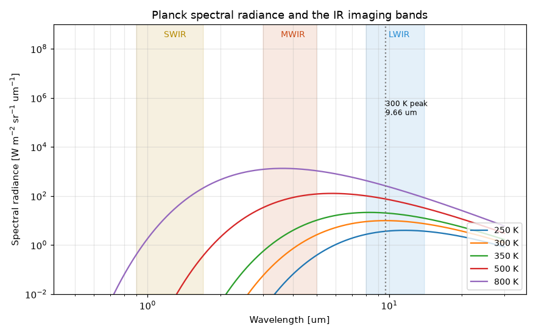
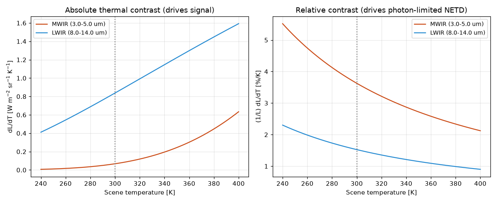
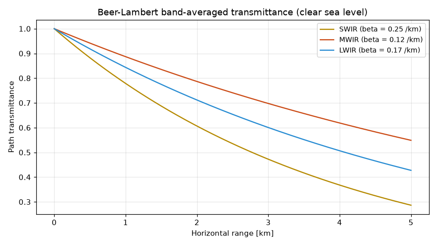
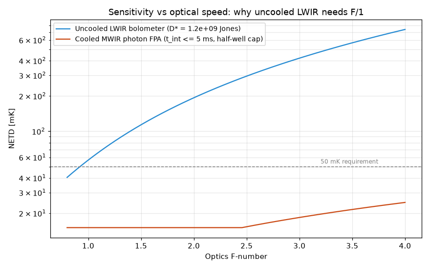
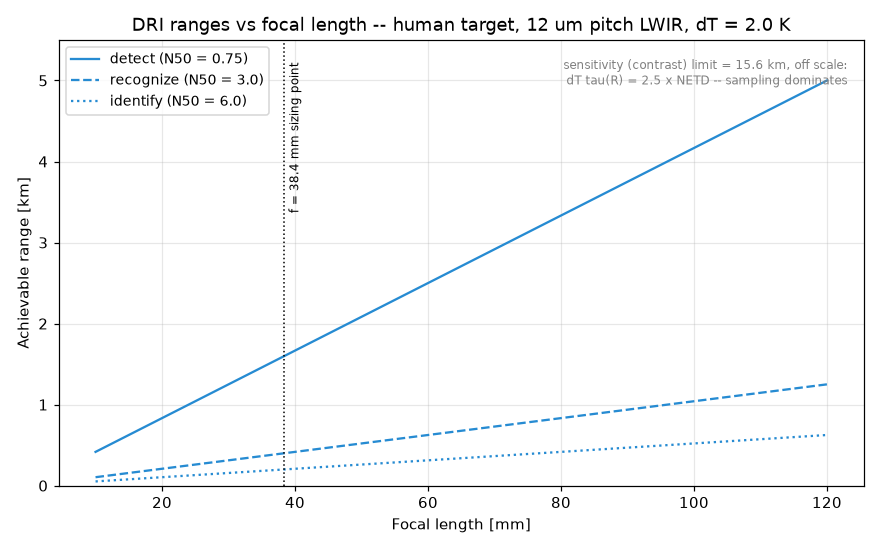

# Physics Analysis of IR Camera Requirements

This document derives, from first principles, the physical relationships
that drive infrared camera requirements, and exercises them on a concrete
reference scenario. Every number quoted here is computed by the `ircam`
package (validated in `tests/test_physics.py`) and reproduced by
`analysis/run_analysis.py`, which writes the tables in
[`computed_results.md`](computed_results.md) and the figures in
[`figures/`](../figures).

**Reference scenario** (a stand-in until a real mission is specified):
a fixed surveillance camera that must *recognize a human at 400 m* in a
clear sea-level atmosphere, against a 300 K background with a 2 K
inherent target contrast, at video frame rates. Changing the scenario
changes the numbers, not the method.

---

## 1. The requirement chain

An IR camera requirement set closes when four links are consistent:

```
Scene physics      What flux and thermal contrast does the scene offer
   |               in each band? (Planck's law)
Atmosphere         How much of it survives the path? (windows, extinction)
   |
Optics             How much is collected, and at what resolution?
   |               (aperture, F#, diffraction, sampling)
Detector           How much signal/noise does it become?
                   (QE, D*, wells, NETD)
```

The two system-level figures of merit that requirements are written
against are:

* **NETD** (noise-equivalent temperature difference) — sensitivity: the
  scene temperature step that produces SNR = 1.
* **DRI ranges** (detect / recognize / identify) — spatial performance:
  how far away a task can be performed on a given target.

## 2. Scene radiometry — what the scene offers

Planck spectral radiance of a blackbody at temperature T:

$$L_\lambda(\lambda,T) = \frac{2hc^2}{\lambda^5}\,
\frac{1}{e^{hc/\lambda k T}-1}
\quad [\mathrm{W\,m^{-2}\,sr^{-1}\,m^{-1}}]$$



Key consequences for a terrestrial (≈300 K) scene:

* Wien's law puts the emission peak at **9.66 µm** — the middle of the
  LWIR window. Terrestrial thermal imaging is naturally an LWIR problem.
* Total radiance is σT⁴/π = **146 W m⁻² sr⁻¹**, of which the 8–14 µm
  band carries **37.6%** (54.9 W m⁻² sr⁻¹), the 3–5 µm band only
  **1.3%** (1.87 W m⁻² sr⁻¹), and the SWIR band essentially nothing
  (3×10⁻⁷ W m⁻² sr⁻¹). **SWIR is a reflected-light band**, usable at
  night only with illumination (nightglow, laser); it is excluded from
  the thermal trade below.

What matters for imaging is not the flux but the *thermal contrast*
dL/dT, because the camera renders small temperature differences:

| At 300 K | MWIR (3–5 µm) | LWIR (8–14 µm) |
|---|---|---|
| In-band radiance L | 1.87 W m⁻² sr⁻¹ | 54.9 W m⁻² sr⁻¹ |
| Absolute contrast dL/dT | 0.068 W m⁻² sr⁻¹ K⁻¹ | 0.838 W m⁻² sr⁻¹ K⁻¹ |
| Relative contrast (1/L)dL/dT | **3.6 %/K** | 1.5 %/K |
| Photon radiance | 4.2×10¹⁹ ph s⁻¹ m⁻² sr⁻¹ | 3.0×10²¹ ph s⁻¹ m⁻² sr⁻¹ |



This is the physical root of the classic band trade:

* **LWIR** offers ~12× the absolute signal — it tolerates lossy,
  uncooled detectors and keeps working on cold scenes.
* **MWIR** offers ~2.4× the *relative* contrast — when the detector is
  good enough that photon (shot) noise dominates, noise scales with
  √flux while signal scales with flux × relative contrast, so MWIR
  yields lower NETD per collected photon. MWIR also favours hot targets
  (exhaust plumes, engines): its in-band radiance rises much faster with
  temperature (see `band_radiance_vs_temperature.png`).

## 3. Atmosphere — what survives the path

The atmosphere transmits only inside the 3–5 µm and 8–14 µm windows
(SWIR windows exist below 2.5 µm); between them, H₂O and CO₂ absorb
almost completely, and CO₂ notches out 4.2–4.4 µm inside MWIR. Within a
window we model the band-averaged path loss as Beer–Lambert,
τ(R) = e^(−βR), with clear sea-level extinctions of roughly
0.12 /km (MWIR), 0.17 /km (LWIR), 0.25 /km (SWIR):



Humidity hits MWIR and LWIR differently (LWIR suffers more from the
water-vapour continuum; MWIR from humidity in the tropics), and aerosols
hit shorter wavelengths harder. **This one-parameter model is adequate
for requirement trades only**; the flowdown to a real specification must
use MODTRAN (or measured data) for the specified operating environment
— that is the single largest fidelity gap in this analysis (§9).

## 4. Optics — collection and resolution

For a pixel of area A_d behind optics of F-number F and transmittance
τ_o, staring at an extended scene of radiance L, the collected flux is

$$\Phi = L \, A_d \, \Omega \, \tau_o,\qquad
\Omega = \frac{\pi}{4F_\#^2+1} \approx \frac{\pi}{4F_\#^2}.$$

Two consequences:

* **Sensitivity buys aperture speed, not aperture size.** For an
  extended source the pixel flux depends on F#, not on the aperture
  diameter. Range (resolution) buys focal length; together they set the
  aperture D = f/F#, which is where cost and mass enter.
* **Diffraction pins the useful F# to the pixel pitch.** The Airy null
  radius is 1.22λF#. The sampling figure of merit Q = λF#/p reaches 2
  at critical sampling; thermal imagers run detector-limited at
  Q ≈ 0.5–1.2. At LWIR (λ ≈ 11 µm) with a 12 µm pitch, F/1 gives
  Q = 0.92 — F/1 is simultaneously what NETD needs (§6) and roughly the
  slowest optic that doesn't blur away the pixel. This coincidence is
  why uncooled LWIR cameras are so uniform in their optical design.

Geometry: IFOV = p/f, ground sample distance GSD = IFOV·R, full field
of view ≈ 2·atan(Np/2f).

## 5. Detectors — two physical regimes

**Uncooled microbolometers (LWIR).** Absorbed flux heats a thermally
isolated bridge; resistance change is read out. No photon counting, no
cryocooler; noise is characterised by a specific detectivity D*
(≈10⁹ Jones effective for modern VOx/a-Si). Time constant ~10 ms limits
them to conventional video rates. They live in LWIR because only there
is the absolute contrast (0.84 W m⁻² sr⁻¹ K⁻¹) large enough to overcome
their modest D*.

**Cooled photon detectors (MWIR/LWIR: InSb, HgCdTe, T2SL).** Photons
generate carriers counted in a well; cooling (~80 K) suppresses dark
current. They approach the background-limited (BLIP) regime where shot
noise on the scene photon flux is the noise floor — the best physics
allows without reducing the background. The price: cryocooler mass,
power, cost, and cooldown time.

## 6. Sensitivity (NETD) — both routes computed

**D\* route (uncooled).** The classic Lloyd expression:

$$\mathrm{NETD} = \frac{(4F_\#^2+1)\sqrt{\Delta f}}
{\sqrt{A_d}\;\tau_o\; D^*\; (\partial M/\partial T)}$$

With F/1, 12 µm pitch, D* = 1.2×10⁹ Jones, Δf = 15 Hz (30 Hz video),
τ_o = 0.9 and the computed ∂M/∂T = 2.63 W m⁻² K⁻¹ (8–14 µm, 300 K):
**NETD = 57 mK** — matching commercial uncooled specs (≤60 mK typ).

**Photon-counting route (cooled).** The chain in `ircam.radiometry`
integrates the in-band photon radiance through the optics onto the
pixel: N_e = η L_q A_d Ω τ_o t_int, with shot + read noise and
NETD = σ_n/(dN_e/dT). For the MWIR design of §8 (F/2.5, 15 µm pitch,
η = 0.7, 5 ms integration): 3.4×10⁶ electrons (48% of a 7×10⁶ e⁻ well),
1.2×10⁵ e⁻/K, 1864 e⁻ noise → **NETD = 15 mK** — again matching real
cooled-MWIR cameras (15–25 mK typ).



The figure shows the central sensitivity trades:

* Uncooled NETD grows ~F#² — an uncooled LWIR camera **must** have ~F/1
  optics; by F/1.4 the 50 mK class is gone. This forbids slow telephoto
  designs and is the strongest single constraint uncooled physics puts
  on the system.
* The cooled chain is flat while integration time can be traded against
  well fill (well-capacity-limited), and only degrades once the fixed
  frame time can no longer fill the well (photon-starved). Cooled MWIR
  therefore tolerates F/2.5–F/4, enabling long-focal-length designs at
  reasonable aperture — the physical reason long-range imagers are
  cooled MWIR.

## 7. Spatial performance — DRI ranges

Task performance is estimated with Johnson-criteria N50 cycles across
the target critical dimension (NVESD 2-D values: detect 0.75,
recognize 3.0, identify 6.0). A sampled imager resolves at best one
cycle per two pixels, so the sampling-limited task range is

$$R = \frac{d_c\, f}{2\,p\,N_{50}}.$$

Sensitivity limits range independently: the apparent contrast
ΔT₀·τ(R) must exceed k·NETD (k = 2.5 here). The achievable range is the
smaller of the two.



For the reference scenario both candidate designs are **sampling-
limited, not sensitivity-limited**: a 2 K target through the clear-air
model stays above 2.5×NETD to ~16 km (LWIR) / ~33 km (MWIR), while
sampling caps recognition at 400 m. This is the normal situation for
modern imagers in clear air, and it means: *resolution requirements
drive focal length and format; sensitivity requirements drive band,
detector class, and F#; they are nearly separable* — until degraded
weather pulls the contrast limit inward, which is what band selection
must be re-checked against (§9).

## 8. Worked requirement flowdown

Requirement: recognize a human (d_c = 0.75 m) at 400 m, N50 = 3.0.

Focal length: f = 2·p·N50·R/d_c → **38.4 mm** (12 µm pitch) or
**48.0 mm** (15 µm pitch). Both computed designs:

| | Design A: uncooled LWIR | Design B: cooled MWIR |
|---|---|---|
| FPA | 640×512, 12 µm, D* = 1.2e9 Jones | 640×512, 15 µm InSb-class, η=0.7 |
| Optics | 38.4 mm F/1, τ=0.9 | 48.0 mm F/2.5, τ=0.85 |
| Aperture | 38.4 mm | 19.2 mm |
| IFOV / FOV | 0.31 mrad / 11.4°×9.1° | 0.31 mrad / 11.4°×9.1° |
| Sampling Q | 0.92 | 0.67 |
| NETD | 57 mK | 15 mK |
| DRI (achievable) | 1600 / 400 / 200 m | 1600 / 400 / 200 m |
| SWaP-C | no cooler; low | cryocooler: +kg, +W, +$$, cooldown minutes |

**Conclusion for this scenario:** both meet the task; identical DRI (set
by sampling), and sensitivity margin is ample in clear air. Design A
(uncooled LWIR) wins on SWaP-C and is the recommended baseline.
Design B becomes the answer if any of these enter the requirements:
range growth beyond ~1 km recognition (needs slow long optics → cooled),
humid/degraded atmosphere margins, hot-target discrimination, or
NETD < 30 mK for weak-contrast scenes.

### Derived requirement set (Design A baseline)

| # | Requirement | Value | Driven by |
|---|---|---|---|
| R1 | Spectral band | 8–14 µm | 300 K scene peak; uncooled physics; §2 |
| R2 | Detector | uncooled µbolometer, 640×512, 12 µm, D* ≥ 1.2e9 Jones | SWaP-C; NETD; §5–6 |
| R3 | Focal length | ≥ 38.4 mm | recognition at 400 m; §7–8 |
| R4 | F-number | ≤ 1.0 | NETD ≤ 60 mK with R2; Q ≤ 1; §4, §6 |
| R5 | NETD | ≤ 60 mK @ f/1, 300 K, 30 Hz | contrast margin ≥ 2.5× at task range; §6 |
| R6 | Frame rate | ≥ 30 Hz | video; bolometer τ_th ~10 ms compatible; §5 |
| R7 | FOV | ≥ 11.4° × 9.1° | coverage at R3 with R2 format; §4 |
| R8 | Optics transmittance | ≥ 0.9 (8–14 µm) | NETD budget; §6 |

## 9. Model limitations — the fidelity ladder

Honest scope of this framework, in order of importance to fix:

1. **Atmosphere**: Beer–Lambert with one β per band. Real flowdown needs
   MODTRAN spectral transmittance plus path radiance for the specified
   environments (humidity, rain, fog, dust), which can invert the
   MWIR/LWIR ranking.
2. **Task model**: Johnson/N50 with a hard Nyquist cutoff. Modern
   practice is NVESD's TTP metric with full system MTF (optics,
   detector, motion, display) and eye model; MRTD links NETD and MTF
   rather than treating them separably as done here.
3. **Bolometer noise**: single effective D*; real budgets carry 1/f
   noise, thermal fluctuation and readout terms, and NETD×τ_th
   trade-offs.
4. **Radiometric couplings** neglected: optics self-emission and
   narcissus (matters for uncooled and warm optics), non-unity scene
   emissivity and reflected background, solar clutter in SWIR/MWIR,
   atmospheric turbulence (blur at long range), and non-uniformity
   residuals (NUC quality often limits uncooled imagery, not NETD).
5. **Detector detail**: dark-current temperature dependence ("Rule 07"
   for HgCdTe), cold-shield efficiency < 1, fill factor, and crosstalk.

Each of these is an incremental refinement inside the same structure:
scene → path → optics → detector → figures of merit.

---

*Package layout:* `ircam.planck` (validated blackbody radiometry),
`ircam.atmosphere`, `ircam.optics`, `ircam.detector` (D*, BLIP, Lloyd
NETD), `ircam.radiometry` (photon chain), `ircam.range_performance`
(Johnson DRI). Reproduce everything with
`pip install -e . && pytest && python analysis/run_analysis.py`.
