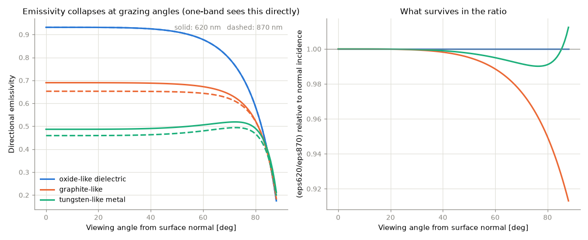
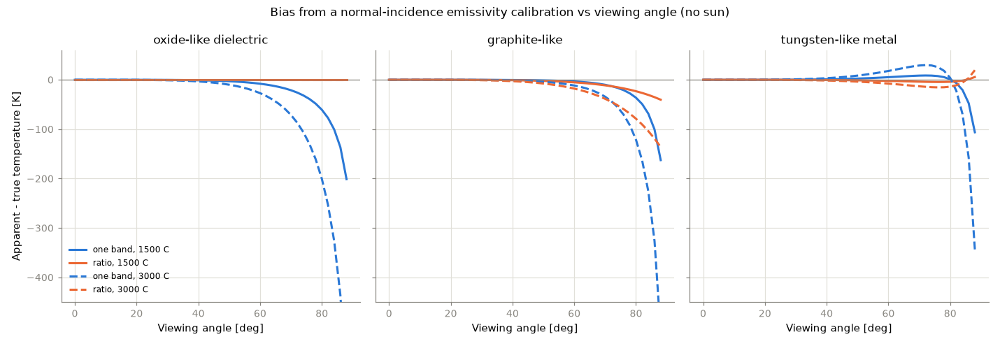
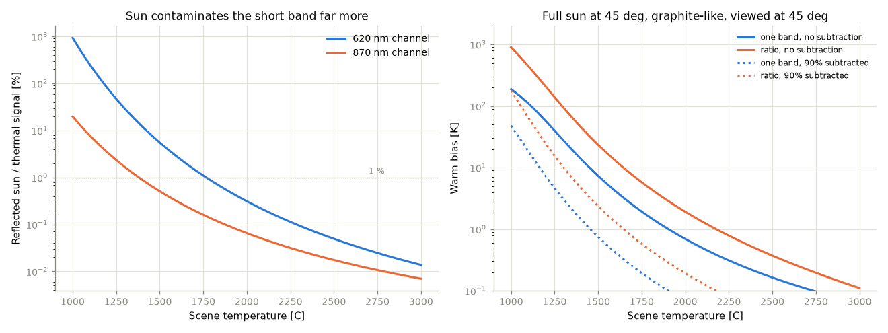
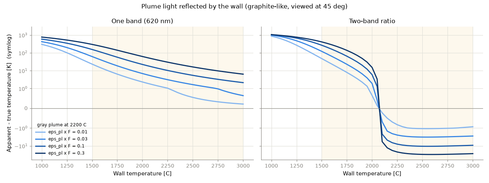
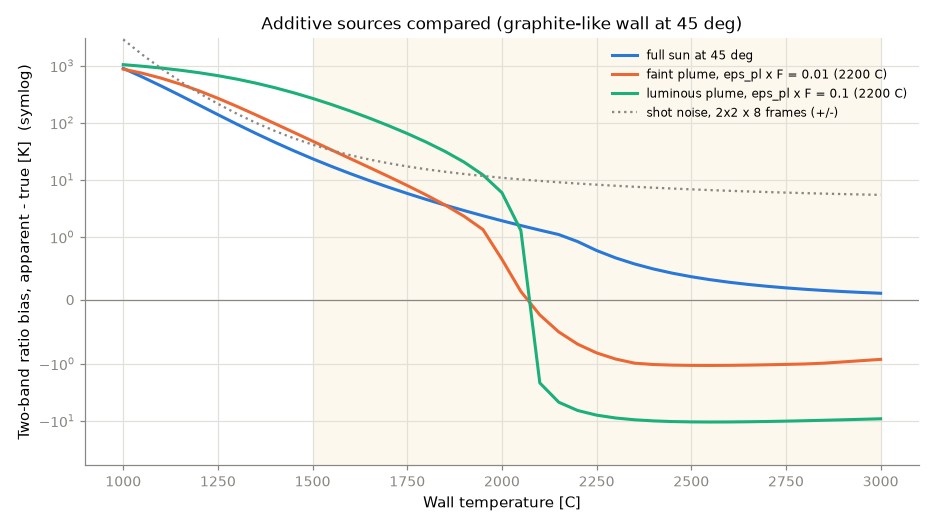

# Viewing Angle, Reflected Sunlight and Plume Reflection

Three error terms that the plain radiometric chain leaves out, quantified
for the nozzle instrument (IMX900 LCG, F/4, 620/870 nm). The first is
multiplicative and varies across the frame; the other two are additive
and, counter-intuitively, hurt the two-band ratio more than a single band.
Of the two additive terms, plume light reflected by the wall is the larger
for any luminous plume and the harder to remove.
Numbers come from `analysis/nozzle_geometry_sun.py`
([`computed_geometry_sun_results.md`](computed_geometry_sun_results.md));
the model is `ircam.surface`, tested in `tests/test_surface.py`. The
interactive version is tab 4 of `streamlit_app.py`.

**Scope of the model.** Directional emissivity uses the smooth-surface
Fresnel equations with complex refractive indices that are *illustrative
class values* (an oxide-like dielectric, a graphite-like semi-metal, a
tungsten-like metal), not measurements of any nozzle material. Rough
surfaces are more Lambertian than this up to fairly grazing angles, so
the Fresnel curve is a worst case for the angular collapse. Sunlight is
the ASTM G173 AM1.5G spectrum (about 10% uncertain), reflected diffusely
with reflectance 1 − ε(θ_v). A coupon measurement of ε(θ, λ) at both
notch wavelengths replaces the first assumption; a pyranometer reading on
the day replaces the second.

---

## 1. Distance drops out; angle does not

For a pixel-filling surface the pixel irradiance is L·π/(4F²+1)·τ, with no
distance term: the flux from any patch falls as 1/R² while the pixel's
footprint grows as R², and the two cancel. A camera calibrated on a lamp
at 1 m reads a nozzle at 40 m without correction. Viewing angle enters
through three separate mechanisms instead.

**Foreshortening.** The footprint stretches by 1/cos θ along the line of
sight: 2× at 60°, 3.9× at 75°, 11.5× at 85°. Axial gradients smear inside
a pixel; circumferential resolution is unaffected. A truly parallel view
has zero projected area.

**Directional emissivity.** Emissivity is flat to roughly 60° from the
normal and then collapses toward zero at grazing incidence (metals first
rise slightly near 75°). Because the local viewing angle changes
continuously along a bell seen from its exit, this is a multiplicative
error that differs from pixel to pixel:

**Reflectance.** Whatever emissivity loses, reflectance gains
(ρ = 1 − ε for an opaque surface). An oxide-like surface goes from 7%
reflective at normal incidence to 63% at 85°, so a grazing wall becomes a
mirror for the plume, the sky, and, inside the bell, the throat. Reflected
throat radiation makes the divergent wall read hot; it is additive and is
not cancelled by the ratio.

## 2. Angle-only bias: one band vs ratio

With the instrument calibrated against a normal-incidence coupon, the
apparent temperature at oblique views is:

| Material | Angle | One band, 1500 °C | Ratio, 1500 °C | One band, 3000 °C | Ratio, 3000 °C |
|---|---|---|---|---|---|
| oxide-like dielectric | 75° | −35 K | 0 K | −117 K | 0 K |
| oxide-like dielectric | 85° | −116 K | 0 K | −375 K | 0 K |
| graphite-like | 75° | −18 K | −16 K | −62 K | −55 K |
| graphite-like | 85° | −82 K | −33 K | −270 K | −111 K |
| tungsten-like metal | 75° | +8 K | −4 K | +28 K | −15 K |
| tungsten-like metal | 85° | −32 K | 0 K | −107 K | −2 K |

The ratio cancels the angular factor exactly when it is the same in both
bands (the dielectric, and very nearly the metal) and only partly when the
optical constants differ between 620 and 870 nm (the graphite-like case
drifts 7% by 85°). For a graphite-like surface the ratio buys little
below 75°; its advantage appears beyond that. In every case the single
band is exposed to the full collapse, which reaches hundreds of kelvin at
3000 °C past 80°.

## 3. Reflected sunlight: additive, and worse for the ratio

Reflected sun is a fixed radiance added to each channel, while the thermal
signal falls steeply toward cooler scene temperatures, so the
contamination fraction rises fast toward the cold end. It is much larger
in the short band because the thermal spectrum at 1500 °C is ~9× weaker at
620 nm than at 870 nm while sunlight is 1.5× stronger there:

| Scene T | Sun / signal, 620 nm | Sun / signal, 870 nm | One band | Ratio | Ratio after 90% subtraction |
|---|---|---|---|---|---|
| 1200 °C | 79% | 3.4% | +57 K | +205 K | +24 K |
| 1500 °C | 5.5% | 0.5% | +7 K | +23 K | +2 K |
| 2000 °C | 0.3% | 0.07% | +1 K | +2 K | 0 K |
| 2500 °C | 0.05% | 0.02% | 0 K | 0 K | 0 K |

(Graphite-like, viewed at 45°, full sun at 45° from the surface normal.)

Two things follow. First, the ratio's immunity applies to *multiplicative*
common-mode terms only; an additive term that is different in the two
bands shifts the ratio, and the shift is then amplified by λ_eq, which is
3.5× the single band's λ. Under full sun the ratio bias is roughly three
times the one-band bias at every temperature. Second, above ~2000 °C the
sun is irrelevant for either method, and below ~1400 °C it dominates both.

**Mitigation is direct.** Before ignition the nozzle is cold, so a
pre-ignition frame in each band is a per-pixel measurement of the
reflected-sun term itself. Subtracting it removes the bias in proportion
to how well the reflectance and sun geometry hold during the burn; a 90%
subtraction takes the 1500 °C ratio bias from +23 K to +2 K. Shading the
nozzle or testing at night removes it entirely. Note also that sunlight
and an oblique view push in opposite directions (sun warm, angle cold);
the combined scenario below shows them nearly cancelling for one band at
1500 °C, which is a coincidence of the chosen geometry and not something
to design around.

**Specular glint is a separate hazard.** If the sun's reflection lands in
the camera, the glint radiance at 620 nm is 9–11× that of a 3000 °C
surface and saturates the pixel outright. The sun-surface-camera specular
geometry must be excluded by camera placement or shading; no calibration
recovers a clipped pixel.

## 4. Plume light reflected by the wall

The plume is a bright extended source sitting next to (or, for an interior
view, inside) the surface being measured. A wall element that sees the
plume over a cosine-weighted hemisphere fraction F reflects

L_refl(λ) = (1 − ε(θ_v)) · F · ε_pl(λ) · L_bb(λ, T_pl),

and the same plume radiance reaches every pixel through veiling glare in
the optics as g · ε_pl · L_bb(T_pl), with g the lens glare index times the
plume's area fraction in the field. Both are additive in exactly the way
sunlight is, with three differences: the plume radiates at 1800–2600 °C
rather than the sun's diluted 1.4 W m⁻² nm⁻¹, it fills a far larger solid
angle at the wall, and it exists only during the burn, so no pre-ignition
frame can capture it.

**Magnitude.** At a 1500 °C wall beside a 2200 °C plume, each 0.01 of
ε_pl·F adds 18% to the 620 nm signal and 7.5% at 870 nm. The plume band
emissivity is the decisive unknown: a clean hydrolox or lean methalox
plume has ε_pl of order 10⁻³–10⁻² in notches placed off its lines, while a
sooty kerosene plume or an Al₂O₃-laden solid-motor plume reaches 0.1–0.9.

| Wall T | Plume / signal, 620 nm | Plume / signal, 870 nm | One band | Ratio | Ratio, 70% in-frame subtraction |
|---|---|---|---|---|---|
| 1200 °C | 2650% | 500% | +393 K | +753 K | +582 K |
| 1500 °C | 185% | 75% | +155 K | +267 K | +121 K |
| 2000 °C | 10.5% | 9.6% | +22 K | +6 K | +2 K |
| 2500 °C | 1.7% | 2.6% | +5 K | −10 K | −3 K |
| 3000 °C | 0.5% | 1.0% | +2 K | −9 K | −3 K |

(Graphite-like wall viewed at 45°, gray plume at 2200 °C, ε_pl·F = 0.1,
for example ε_pl = 0.5 with F = 0.2.)

| ε_pl·F | Plume 1800 °C | Plume 2200 °C | Plume 2600 °C |
|---|---|---|---|
| 0.003 | +1 K | +15 K | +64 K |
| 0.01 | +5 K | +48 K | +181 K |
| 0.03 | +13 K | +121 K | +383 K |
| 0.1 | +38 K | +267 K | +641 K |
| 0.3 | +83 K | +411 K | +802 K |

(Ratio bias at a 1500 °C wall.)

Three features of these numbers matter for the design:

- **The term is governed by the Planck ratio between plume and wall.**
  Where the wall is cooler than the plume it dominates everything else in
  the budget; where the wall is hotter it fades to a few kelvin and
  changes sign for the ratio (the plume then adds relatively more to the
  870 nm band, pulling the ratio cold). The 1500–2000 °C part of the
  primary range next to a 2200 °C plume is the exposed region.
- **A faint plume is enough.** ε_pl·F = 0.01, which a clean plume with a
  modest view factor can reach, still costs +48 K at 1500 °C, comparable
  to the whole averaged shot-noise budget.
- **Wall position sets F.** Elements near the exit lip see the plume over
  a large fraction of their hemisphere; elements far up the bell see it
  nearly edge-on. An interior view up the bell is the worst case, because
  the wall is enclosed by hot gas and sees the throat, which is hotter
  than the divergent wall.

**Mitigation.** The plume is in the image. Plume pixels give ε_pl·L_bb(T_pl)
directly in both bands for every frame, and a view-factor model built from
the nozzle geometry gives F per wall pixel, so the reflected term can be
predicted and subtracted frame by frame. The residual scales with the
uncertainty in (1 − ε)·F, realistically 30–50%, which is the 70%
subtraction column above: +267 K becomes +121 K at 1500 °C. A third notch
adds leverage, because the reflected light carries the plume's spectral
slope rather than the wall's, and three bands allow the plume amplitude to
be fitted per pixel instead of modelled. Where the plume is luminous and
the wall is cooler than it, nothing short of this subtraction gives a
usable number below about 2000 °C.

## 5. Combined budget at the recommended geometry

Graphite-like surface viewed at 70°, full sun at 45°, normal-incidence
calibration, no background subtraction:

| Scene T | One band: angle / sun / both | Ratio: angle / sun / both | Shot noise (2×2 × 8 frames) |
|---|---|---|---|
| 1500 °C | −10 / +9 / −1 K | −11 / +29 / +17 K | 41 K |
| 2250 °C | −20 / 0 / −20 K | −23 / +1 / −22 K | 8 K |
| 3000 °C | −34 / 0 / −34 K | −39 / 0 / −38 K | 5 K |

At 70° with a graphite-like surface the angle term is similar for both
methods and comparable to the shot noise at the hot end, and the sun term
is only significant at the cold end, where it is larger for the ratio. With
the pre-ignition subtraction the sun column shrinks by an order of
magnitude and the angle term is what remains to be measured on a coupon.

## 6. Design consequences

- Keep the view within 60–70° of the surface normal where possible; use a
  periscope mirror to steepen the angle if the camera must sit below the
  exit plane. Past 75° axial resolution is gone and the emissivity
  collapse dominates.
- Record pre-ignition frames in both bands and subtract them; shade the
  nozzle from direct sun if the test is in daylight; exclude the specular
  sun geometry.
- Measure ε(θ) at 620 and 870 nm on a coupon of the actual nozzle material
  and use the measured band ratio in the calibration; the illustrative
  constants here only bound the effect.
- For a luminous plume, plan the plume subtraction from the start: record
  plume radiance from in-frame plume pixels in both bands, build the
  per-pixel view factor from the nozzle geometry, and prefer wall regions
  and viewing directions with small F. Consider a third notch so the plume
  amplitude can be fitted rather than modelled.
- Treat the ratio's advantage precisely: it removes multiplicative
  common-mode terms (emissivity level, fouling, geometry, exposure when
  shared) and most of the angular factor, and it does not remove additive
  terms (sunlight, plume and throat reflections, veiling glare), which it
  amplifies.
